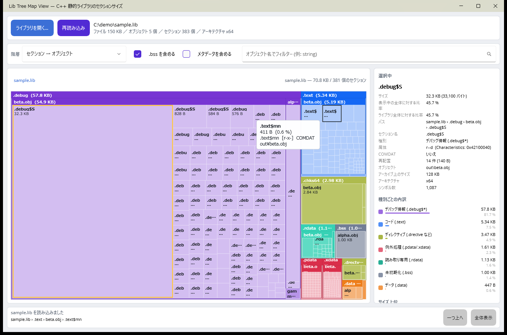
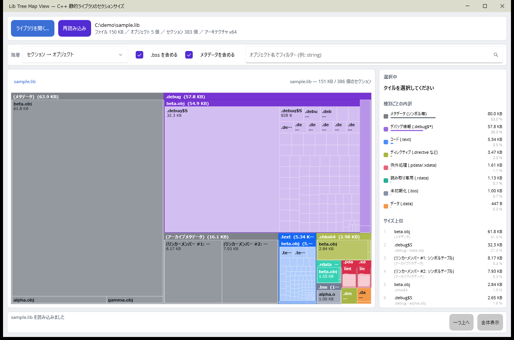

# Lib Tree Map View

C++ の静的ライブラリ (`.lib`) を読み込み、**セクション単位のサイズ**をツリーマップで可視化する Windows デスクトップアプリです。
Visual Studio 2026 / .NET 10 / .NET MAUI で作られています。

「このライブラリはなぜこんなに大きいのか」を、`.debug$S` なのか `.text` なのか、
どのオブジェクトファイルが効いているのか、という粒度で追いかけるための道具です。



## できること

- MSVC 形式の COFF アーカイブ (`.lib`) を解析し、オブジェクトファイルごとのセクション構成を取り出す
- squarified treemap による面積比較（面積 = バイト数）
- 3 種類の階層表示
  - セクション → オブジェクト（既定）
  - オブジェクト → セクション
  - セクション名 (COMDAT 単位、`.text$mn` など) → オブジェクト
- ホバーで詳細ツールチップ、クリックで選択（右パネルに属性・COMDAT・再配置数などを表示）
- ダブルクリックでズームイン、パンくず／「一つ上へ」／「全体表示」でズームアウト
- 種別ごとの内訳とサイズ上位 20 件の一覧
- オブジェクト名でのフィルター
- `.bss` (ファイル上に実体を持たない領域) の表示 ON/OFF
- アーカイブのメタデータ（シンボルテーブル、再配置、ヘッダー）の表示 ON/OFF
- インポートライブラリ (`lib /def:` で作るもの) の記述子も表示
- ファイルのドラッグ＆ドロップ、コマンドライン引数での読み込み
- ライト／ダークテーマ追従

## 動作要件

- Windows 10 バージョン 1809 (10.0.17763) 以降
- .NET 10 SDK
- .NET MAUI ワークロード (`maui-windows`)
  - Visual Studio 2026 のインストーラーで「.NET マルチプラットフォーム アプリ UI 開発」を選ぶか、
    `dotnet workload install maui-windows` を実行してください。

## ビルドと実行

Visual Studio 2026 で `LibTreeMapView.slnx` を開き、`LibTreeMapView` をスタートアップ プロジェクトにして F5 で実行できます。

コマンドラインからの場合:

```bash
dotnet build LibTreeMapView.slnx
```

```bash
dotnet run --project src/LibTreeMapView -f net10.0-windows10.0.19041.0
```

解析したいライブラリを最初から開くには、引数に渡します:

```bash
dotnet run --project src/LibTreeMapView -f net10.0-windows10.0.19041.0 -- C:\path\to\your.lib
```

### 試すためのサンプル

`samples/build-samples.cmd` を実行すると、MSVC で `samples/out/sample.lib`（通常の静的ライブラリ）と
`samples/out/import.lib`（インポートライブラリ）を生成します。ウィンドウにドロップしてください。

## 操作方法

| 操作 | 動作 |
| --- | --- |
| タイルにホバー | ツールチップとステータスバーにパス・サイズ・属性を表示 |
| タイルをクリック | 選択して右パネルに詳細を表示 |
| タイルをダブルクリック | そのまとまりにズームイン（末端の場合は 1 つ上のまとまり） |
| パンくずのボタン | その階層まで戻る |
| 「一つ上へ」／「全体表示」 | ズームアウト |
| ウィンドウにファイルをドロップ | その `.lib` を開く |

## 表示しているサイズについて

- 各セクションのサイズは COFF セクションヘッダーの `SizeOfRawData` です（0 の場合は `VirtualSize`）。
  `dumpbin /headers` の "size of raw data" と一致します。
- `.bss` など未初期化セクションはファイル上にデータを持ちません。サイズは確保される領域の大きさで、
  ライブラリのファイルサイズには含まれません。合計をファイルサイズと突き合わせたいときは
  「.bss を含める」を外してください。
- 「メタデータを含める」を有効にすると、シンボルテーブル・再配置レコード・文字列テーブル・
  アーカイブのリンカーメンバーなど、セクション実体以外の領域も表示します。
  これを入れて `.bss` を外すと、合計はほぼファイルサイズ（差はメンバーヘッダー 60 バイト×メンバー数）になります。
- `.text$mn` のような `$` 付きのセクション名は、既定では `$` の前で束ねて `.text` として集計します。
  COMDAT 単位（関数単位）で見たいときは階層を「セクション名 (COMDAT 単位)」に切り替えてください。



## プロジェクト構成

```
src/LibTreeMapView.Core/    UI に依存しない解析ロジック (netstandard 相当の net10.0 ライブラリ)
  Coff/LibReader.cs           アーカイブと COFF ヘッダーの解析
  Coff/SectionClassifier.cs   セクション名・属性からの種別判定
  Model/                      LibraryInfo / ObjectFileInfo / SectionInfo
  Tree/TreeBuilder.cs         階層の組み立て (グループ化・フィルター)
  Layout/TreeMapLayout.cs     squarified treemap の配置計算とヒットテスト
src/LibTreeMapView/         MAUI アプリ (Windows)
  ViewModels/MainViewModel.cs 画面の状態とコマンド
  Drawing/TreeMapDrawable.cs  ツリーマップとツールチップの描画
  Views/MainPage.xaml         画面レイアウト
tests/LibTreeMapView.Core.Tests/  解析とレイアウトの単体テスト
samples/                    サンプル .lib を作る C++ ソースとスクリプト
```

`Core` は MAUI に依存しないので、解析部分だけを別のツールから使うこともできます。

```csharp
LibraryInfo library = LibReader.Read(@"C:\path\to\your.lib");
TreeNode root = TreeBuilder.Build(library, new TreeBuildOptions());
```

## テスト

```bash
dotnet test tests/LibTreeMapView.Core.Tests/LibTreeMapView.Core.Tests.csproj
```

`tests/.../TestData/fixture.lib` は MSVC でビルドした実物のライブラリで、
期待値は `dumpbin /headers` の出力から取っています（長いセクション名の文字列テーブル参照、
COMDAT、`.bss`、インポート記述子などを含む）。

## 制限事項

- 対応形式は MSVC の COFF アーカイブ (`!<arch>` 署名) です。ELF/Mach-O のライブラリは扱えません。
- `/GL` (LTCG) でコンパイルしたオブジェクトは中身が匿名オブジェクトになるため、
  セクション単位には分解できません。メンバー全体を 1 つのブロックとして表示します。
- 読み込めるのは 2 GB 未満のファイルです。
- ツリーマップの描画は 3 階層まで。それより深い要素は親のタイルにまとめて表示します
  （ダブルクリックでズームすればさらに下を見られます）。
