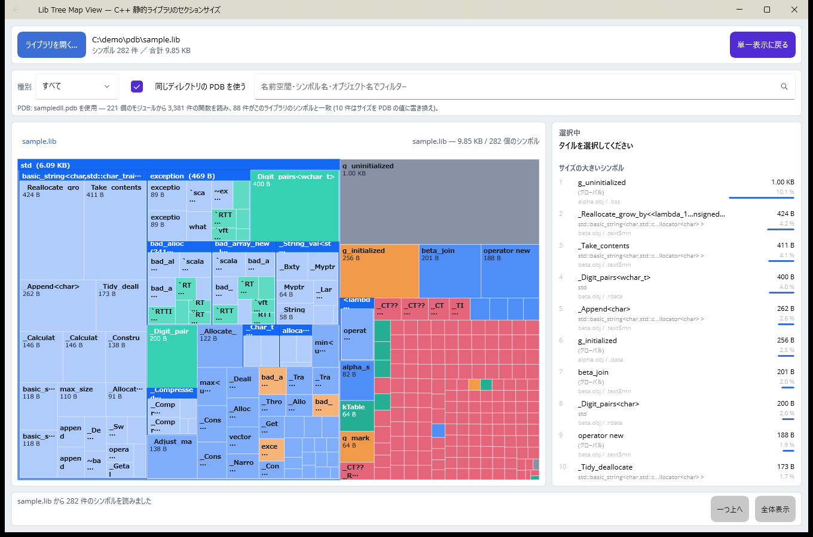
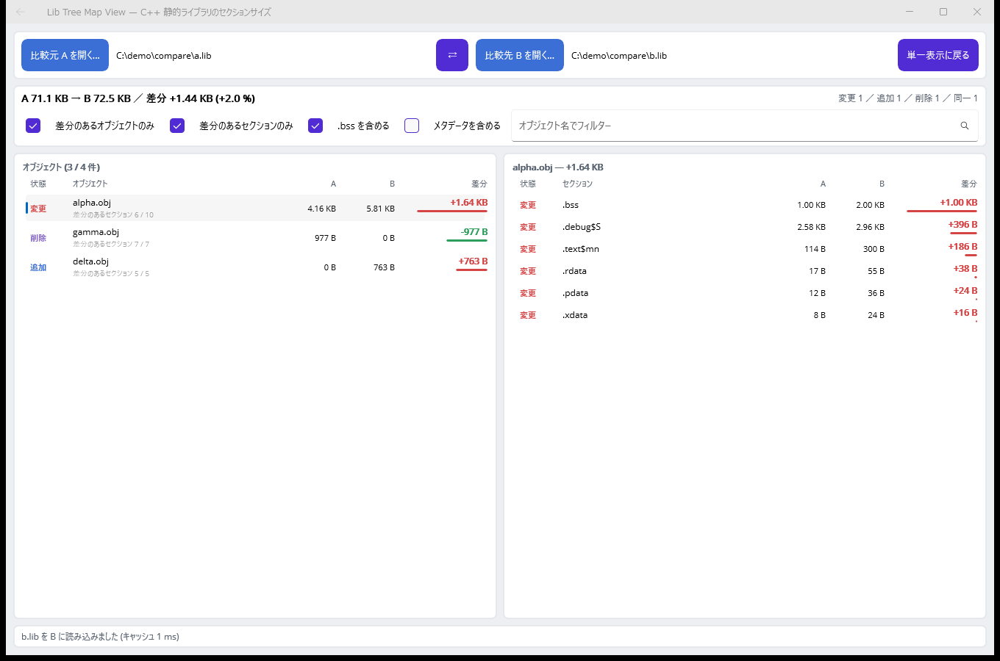

# LibTreeMapView

AIに生成させたコードで何も精査していない状態のため、利用する場合は自己責任でお願いいたします。

C++ の静的ライブラリ (`.lib`) を読み込み、**セクション単位のサイズ**をツリーマップで可視化する Windows デスクトップアプリです。
Visual Studio 2026 / .NET 10 / .NET MAUI で作られています。

「このライブラリはなぜこんなに大きいのか」を、`.debug$S` なのか `.text` なのか、
どのオブジェクトファイルが効いているのか、という粒度で追いかけるための道具です。


## できること

- MSVC 形式の COFF アーカイブ (`.lib`) を解析し、オブジェクトファイルごとのセクション構成を取り出す
- squarified treemap による面積比較（面積 = バイト数）
- 3 種類の階層表示
  - セクション → オブジェクト（既定）
  - オブジェクト → セクション
  - セクション名 (COMDAT 単位、`.text$mn` など) → オブジェクト
- ホバーで詳細ツールチップ、クリックで選択（右パネルに属性・COMDAT・再配置数などを表示）
- ダブルクリックでズームイン、パンくず／「一つ上へ」／「全体表示」でズームアウト
- 種別ごとの内訳とサイズ上位 20 件の一覧
- オブジェクト名でのフィルター
- `.bss` (ファイル上に実体を持たない領域) の表示 ON/OFF
- アーカイブのメタデータ（シンボルテーブル、再配置、ヘッダー）の表示 ON/OFF
- インポートライブラリ (`lib /def:` で作るもの) の記述子も表示
- ファイルのドラッグ＆ドロップ、コマンドライン引数での読み込み
- 解析結果のキャッシュ（同じ .lib を 2 回目以降は解析せずに表示）
- **2 つのライブラリの比較**（差分のあるオブジェクト／セクションだけに絞り込み可能）
- **シンボル単位の内訳**（デマングルして名前空間ごとに整理し、大きいシンボルを特定）
- ライト／ダークテーマ追従

## 動作要件

- Windows 10 バージョン 1809 (10.0.17763) 以降
- .NET 10 SDK
- .NET MAUI ワークロード (`maui-windows`)
  - Visual Studio 2026 のインストーラーで「.NET マルチプラットフォーム アプリ UI 開発」を選ぶか、
    `dotnet workload install maui-windows` を実行してください。

## ビルドと実行

Visual Studio 2026 で `LibTreeMapView.slnx` を開き、`LibTreeMapView` をスタートアップ プロジェクトにして F5 で実行できます。

コマンドラインからの場合:

```bash
dotnet build LibTreeMapView.slnx
```

```bash
dotnet run --project src/LibTreeMapView -f net10.0-windows10.0.19041.0
```

解析したいライブラリを最初から開くには、引数に渡します:

```bash
dotnet run --project src/LibTreeMapView -f net10.0-windows10.0.19041.0 -- C:\path\to\your.lib
```

### 試すためのサンプル

`samples/build-samples.cmd` を実行すると、MSVC で `samples/out/sample.lib`（通常の静的ライブラリ）と
`samples/out/import.lib`（インポートライブラリ）を生成します。ウィンドウにドロップしてください。

## 操作方法

| 操作 | 動作 |
| --- | --- |
| タイルにホバー | ツールチップとステータスバーにパス・サイズ・属性を表示 |
| タイルをクリック | 選択して右パネルに詳細を表示 |
| タイルをダブルクリック | そのまとまりにズームイン（末端の場合は 1 つ上のまとまり） |
| パンくずのボタン | その階層まで戻る |
| 「一つ上へ」／「全体表示」 | ズームアウト |
| ウィンドウにファイルをドロップ | その `.lib` を開く |
| 「2 つを比較…」 | 比較ビューへ移動（開いているライブラリが比較元 A に入る） |
| 「シンボル…」 | シンボルビューへ移動（開いているライブラリのシンボルを読む） |

## 表示しているサイズについて

- 各セクションのサイズは COFF セクションヘッダーの `SizeOfRawData` です（0 の場合は `VirtualSize`）。
  `dumpbin /headers` の "size of raw data" と一致します。
- `.bss` など未初期化セクションはファイル上にデータを持ちません。サイズは確保される領域の大きさで、
  ライブラリのファイルサイズには含まれません。合計をファイルサイズと突き合わせたいときは
  「.bss を含める」を外してください。
- 「メタデータを含める」を有効にすると、シンボルテーブル・再配置レコード・文字列テーブル・
  アーカイブのリンカーメンバーなど、セクション実体以外の領域も表示します。
  これを入れて `.bss` を外すと、合計はほぼファイルサイズ（差はメンバーヘッダー 60 バイト×メンバー数）になります。
- `.text$mn` のような `$` 付きのセクション名は、既定では `$` の前で束ねて `.text` として集計します。
  COMDAT 単位（関数単位）で見たいときは階層を「セクション名 (COMDAT 単位)」に切り替えてください。


## シンボル (名前空間別)

「シンボル…」を押すと、シンボルをデマングルして**名前空間・クラスごとの階層**にまとめたツリーマップを表示します。
`std::basic_string<...>` のようなテンプレート実体がどれだけ効いているか、どの関数が大きいかを追うためのビューです。



- シンボルは **.lib の各オブジェクトが持つ COFF シンボルテーブル**から読みます
- 名前は Windows の `UnDecorateSymbolName` (dbghelp) でデマングルし、`::` で階層に分けます
  （テンプレート引数や `operator<<` の中の記号は区切りとして扱いません）
- 右側に「サイズの大きいシンボル」を上位 30 件表示します。行をクリックするとツリーマップ側も選択されます
- 「関数のみ / データのみ」の切り替えと、名前空間・シンボル名・オブジェクト名でのフィルターがあります
- タイルのダブルクリックでその名前空間へズームし、パンくずで戻れます

### サイズの出所

シンボルのサイズは COFF のシンボルテーブルには書かれていないため、次の順で決めています。
どれを使ったかは選択したシンボルの詳細に出ます。

| 出所 | 精度 | 使われる場面 |
| --- | --- | --- |
| COMDAT セクション | 正確 | テンプレート実体や `/Gy` でコンパイルした関数（1 シンボル = 1 セクション） |
| PDB の関数レコード | 正確 | 同じディレクトリにシンボル入りの PDB があるとき |
| 次のシンボルとの距離 | 概算 | 上記以外（1 つのセクションに複数のシンボルが並んでいる場合） |

### PDB について

`.lib` と同じディレクトリにある PDB を自動で探して読みますが、**MSVC が `.lib` の隣に置く `vcXXX.pdb`
（`cl /Zi` が作るもの）は型情報だけを持っていて、シンボルを含みません**。
その場合は画面にその旨を表示し、サイズは `.lib` から求めた値を使います。

シンボルを持つのは**リンカーが作る PDB**（`link /DEBUG` が exe/dll と一緒に出すもの）です。
それが同じディレクトリにあれば、`S_GPROC32` の正確なコードサイズを取り込み、
「何件が一致して何件を置き換えたか」を表示します。PDB を無視したいときはチェックを外してください。

PDB は MSF コンテナを直接読んでいます（DIA SDK は使っていません）。読めなかった場合も `.lib` 側の
情報だけで表示を続けます。

## 2 つのライブラリの比較

「2 つを比較…」で比較ビューに移ります。ビルド前後の `.lib` を並べて、**どのオブジェクトが増えたのか、
その中のどのセクションが効いているのか**を追うためのビューです。



- 左がオブジェクトの一覧、右が選んだオブジェクトのセクション一覧。どちらも差分の大きい順に並びます
- 状態は **追加 / 削除 / 変更 / 同一** の 4 種類。増加は赤、減少は緑で表示します
- **「差分のあるオブジェクトのみ」**: 同一のオブジェクトを一覧から外します
- **「差分のあるセクションのみ」**: 選んだオブジェクトの中で、サイズの変わったセクションだけを出します
- 合計サイズが同じでも内訳が動いていれば「変更」として扱います
  （例: `.text` が減って `.data` が増えた場合）
- `.bss` とメタデータの扱いは単一表示と同じ設定で切り替えられます
- 「⇄」で A と B を入れ替えられます

突き合わせはオブジェクトファイル名（大文字小文字は区別しない）とセクション名で行い、
同じ名前のメンバーや COMDAT セクションが複数ある場合は合算して比べます。
読み込みにはキャッシュを使うので、一度開いたライブラリとの比較は待たされません。

## キャッシュ

一度開いた .lib は、**UI の表示に必要な情報だけ**を抜き出してローカルに保存します。
次に同じライブラリを開くときは .lib を読み直さず、そのキャッシュから表示します。

- 保存する内容: オブジェクトファイルとセクションの一覧（名前・サイズ・属性・COMDAT・再配置数・
  種別・アーキテクチャ・シンボル数・警告）
- 保存しない内容: セクションの実体、シンボルテーブル、文字列テーブルなど表示に使わないもの
- 同じ名前が大量に出てくるので、文字列は共有プールに寄せています。
  24 MB / 48,638 セクションのライブラリで **キャッシュは 614 KB（元の約 2.4 %）** でした
- 上記のライブラリでの実測（暖機後）は **解析 45 ms → キャッシュ 10 ms**、
  ツリーの組み立てを含めた表示までで **70 ms → 33 ms**。
  .lib 本体を読まないので、ネットワーク上のライブラリや OS のファイルキャッシュに
  載っていないときほど差が出ます
- キャッシュの保存先は `%LOCALAPPDATA%\LibTreeMapView\cache`。
  1 ファイルにつき 1 つ作られ、64 件を超えると古いものから消えます

### 一致の判定

対象の .lib と一致しているかは、**ファイルサイズ・更新日時・指紋**の 3 つで判定します。
指紋はファイルの先頭と末尾の最大 64 KB ずつから作るので、判定のために全体を読むことはありません。
ライブラリを再ビルドすればどれかが変わるため、古い結果が表示されることはありません。
一致しなかった場合は解析し直し、新しい内容で上書きします。

キャッシュを使いたくないときは「キャッシュを使う」のチェックを外します。
「キャッシュ消去」ボタンで保存済みのキャッシュをすべて削除できます
（どちらもボタンにマウスを載せると保存先が出ます）。

## プロジェクト構成

```
src/LibTreeMapView.Core/    UI に依存しない解析ロジック (netstandard 相当の net10.0 ライブラリ)
  Coff/LibReader.cs           アーカイブと COFF ヘッダーの解析
  Coff/SectionClassifier.cs   セクション名・属性からの種別判定
  Model/                      LibraryInfo / ObjectFileInfo / SectionInfo
  Caching/LibraryCache.cs     解析結果のキャッシュ (保存先・世代管理)
  Caching/CacheKey.cs         対象 .lib と一致しているかの判定
  Comparison/LibraryComparer.cs  2 つのライブラリの突き合わせ
  Symbols/CoffSymbolReader.cs COFF シンボルテーブルの読み取りとサイズ推定
  Symbols/Demangler.cs        dbghelp によるデマングル
  Symbols/SymbolNameParser.cs 名前空間・クラスへの分解
  Symbols/PdbSymbolReader.cs  PDB (MSF) から関数のコードサイズを読む
  Symbols/SymbolTreeBuilder.cs 名前空間ツリーの組み立て
  LibraryLoader.cs            キャッシュを見てから解析する読み込み口
  Tree/TreeBuilder.cs         階層の組み立て (グループ化・フィルター)
  Layout/TreeMapLayout.cs     squarified treemap の配置計算とヒットテスト
src/LibTreeMapView/         MAUI アプリ (Windows)
  ViewModels/MainViewModel.cs 画面の状態とコマンド
  ViewModels/CompareViewModel.cs 比較ビューの状態と絞り込み
  ViewModels/SymbolsViewModel.cs シンボルビューの状態
  Drawing/TreeMapController.cs   ツリーマップの操作 (ホバー・選択・ズーム)
  Drawing/TreeMapDrawable.cs  ツリーマップとツールチップの描画
  Views/MainPage.xaml         ツリーマップ画面
  Views/ComparePage.xaml      比較画面
  Views/SymbolsPage.xaml      シンボル画面
tests/LibTreeMapView.Core.Tests/  解析とレイアウトの単体テスト
samples/                    サンプル .lib を作る C++ ソースとスクリプト
```

`Core` は MAUI に依存しないので、解析部分だけを別のツールから使うこともできます。

```csharp
LibraryInfo library = LibReader.Read(@"C:\path\to\your.lib");
TreeNode root = TreeBuilder.Build(library, new TreeBuildOptions());
```

## テスト

```bash
dotnet test tests/LibTreeMapView.Core.Tests/LibTreeMapView.Core.Tests.csproj
```

`tests/.../TestData/fixture.lib` は MSVC でビルドした実物のライブラリで、
期待値は `dumpbin /headers` の出力から取っています（長いセクション名の文字列テーブル参照、
COMDAT、`.bss`、インポート記述子などを含む）。

## 制限事項

- 対応形式は MSVC の COFF アーカイブ (`!<arch>` 署名) です。GNU ar の `.a` も署名は同じですが
  メンバーは ELF なので、解析せずに警告として報告します (ファイル選択ダイアログも `.lib` のみが対象)。
- `/GL` (LTCG) でコンパイルしたオブジェクトは中身が匿名オブジェクトになるため、
  セクション単位には分解できません。メンバー全体を 1 つのブロックとして表示します。
- 読み込めるのは 2 GB 未満のファイルです。
- ツリーマップの描画は 3 階層まで。それより深い要素は親のタイルにまとめて表示します
  （ダブルクリックでズームすればさらに下を見られます）。
- ツリーマップは自前描画のため、タイルをキーボードで選ぶ操作には対応していません。
  同じ内容は右パネルの「サイズ上位」から辿れます（こちらはキーボード・読み上げに対応）。
- シンボルのデマングルは Windows の dbghelp を使うため、Windows 以外ではマングルされた名前のまま表示します。
- データシンボル（変数など）のサイズは PDB からは取れません（型情報の解析が必要なため）。
  `.lib` から求めた値を使います。
